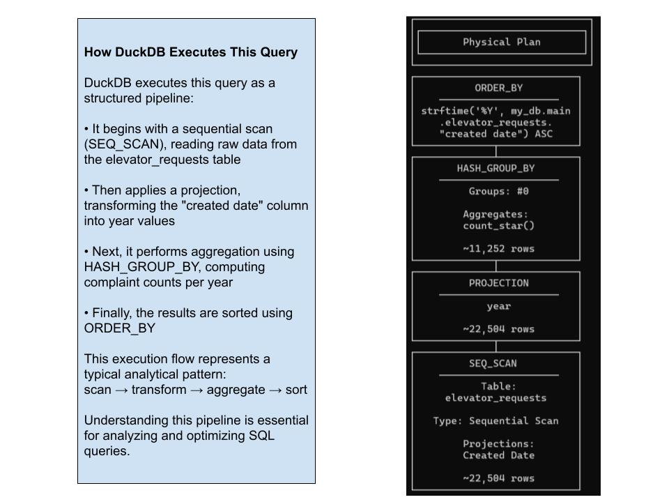

# 🐤 DuckDB ETL Pipeline — NYC 311 Complaints Analysis

Fully reproducible data pipeline using DuckDB, Docker, and SQL-based analytics.


This project is a **data analysis + lightweight ETL pipeline** built using DuckDB and MotherDuck.  
It focuses on **NYC 311 Elevator Service Requests**, transforming raw data into **insight-driven storytelling**.
Includes automated export validation (CSV vs Parquet consistency check).

Perfect for showcasing:
- SQL analytics skills  
- Data storytelling  
- ETL automation  
- Modern analytics stack (DuckDB + cloud)

---

## 📊 Project Overview

This project explores complaint patterns across NYC boroughs.

It answers key questions:
- Do complaints follow seasonal patterns?
- Which boroughs generate the most requests?
- When do complaint peaks occur?

---

## 🚀 Getting Started

Clone the repository and navigate to the project folder:

```bash
git clone https://github.com/evgeniimatveev/nyc-311-duckdb-motherduck-analysis.git

cd nyc-311-duckdb-motherduck-analysis

```
---

## 🔧 Tech Stack

- 🐤 **DuckDB** – in-process analytics engine  
- ☁️ **MotherDuck** – cloud analytics layer  
- 🐍 **Python** – ETL and export automation  
- 🧠 **SQL** – data transformation and aggregation  
- 🐳 **Docker** – reproducible environment  
- 🧑‍💻 **VS Code** – development environment  

---

## 📁 Project Structure

```bash
nyc-311-duckdb-motherduck-analysis/
│
├── data/
│   └── 311_Elevator_Service_Requests_.csv
│
├── exports/
│   ├── clean_requests.csv
│   └── clean_requests.parquet
│
├── screenshots/
│   ├── DBeaver/
│   ├── DuckDB(CLI)/
│   └── Storytelling/
│
├── scripts/
│   ├── 4_1_duckdb_test.py
│   ├── 4_2_elt.py
│   └── 4_3_export.py
│
├── docker-compose.yml
├── Dockerfile
├── requirements.txt
├── elt.duckdb
├── my_duckdb.duckdb
└── README.md

```
---

## ✅ Validation
Follow these steps to run and validate the full pipeline locally:

The pipeline was tested in a clean Docker environment from scratch.

- ✔ Repository cloned into a fresh local directory
- ✔ Docker image built successfully
- ✔ ELT pipeline completed with exit code 0
- ✔ Export pipeline generated CSV and Parquet outputs
- ✔ Export files were re-generated successfully after cleanup
- ✔ Output consistency verified between CSV and Parquet

This ensures full reproducibility and reliability of the data pipeline.

---

Run the following steps to reproduce the pipeline and verify outputs locally:
## 🧪 How to Validate the Pipeline (PowerShell)

```powershell
# 1. Run ELT pipeline
docker compose run --rm duckdb_pipeline

# 2. Run export pipeline
docker compose run --rm export_pipeline

# 3. Verify exported files exist
dir .\exports

# 4. Validate CSV and Parquet consistency
docker compose run --rm duckdb_pipeline python scripts/check_exports.py

```
---

## 🧠 Key Insights

- 📈 Complaint volume shows **clear seasonal spikes (summer peak)**
- 🏙️ Bronx consistently generates the **highest number of complaints**
- 🔧 Majority of issues are related to **non-working elevators and lack of backup systems**
- ⚠️ Infrastructure reliability remains a **system-wide issue across boroughs**
- 📊 Demand is **not evenly distributed**, correlating with urban density

---

## 💼 Business Impact

- Helps identify **high-risk boroughs for infrastructure failure**
- Supports **predictive maintenance planning**
- Enables better **resource allocation across NYC**
- Can be extended into **real-time monitoring dashboards**


---

## 📸 Data Storytelling & Visual Insights

<details>
<summary>📈 Monthly Trend by Borough</summary>

**Insight:** Seasonal trends are consistent across boroughs, with mid-year increases observed everywhere, while absolute complaint volume varies significantly by location.


</details>

<details>
<summary>🌿 Total Complaints by Borough</summary>

**Insight:** Bronx leads in total complaints, indicating higher infrastructure pressure, while Staten Island shows minimal activity, highlighting uneven system load distribution.


</details>

<details>
<summary>🔝 Top Complaint Types</summary>

**Insight:** Most complaints are driven by non-working elevators and lack of backup systems, revealing critical reliability issues across building infrastructure.


</details>

<details>
<summary>📊 Peak Month Detection</summary>

**Insight:** Complaint peaks occur during summer months, while steady activity during winter indicates persistent baseline demand throughout the year.


</details>

<details>
<summary>🔍 Multi-Borough Comparison</summary>

**Insight:** Higher complaint volumes correlate with urban density and building concentration, with Bronx experiencing the greatest system load.

_ui.jpg)

</details>

<details>
<summary>🏢 Top Agencies Handling Requests</summary>

**Insight:** All elevator-related complaints are handled by a single agency (DOB), indicating centralized responsibility but potential operational bottlenecks.


</details>

<details>
<summary>🧪 First Aggregation Step</summary>

**Insight:** Initial aggregation confirms consistent monthly complaint distribution and establishes a reliable baseline for further analytical exploration.


</details>

<details>
<summary>📘 Query Plan Inspection (EXPLAIN)</summary>

**Insight:** The execution plan shows a sequential scan followed by projection and aggregation, illustrating DuckDB’s efficient pipeline-based query processing.



</details>

<details>
<summary>🧠 Advanced Analysis (EXPLAIN ANALYZE)</summary>

**Insight:** Real execution metrics confirm fast query performance with minimal processing time, demonstrating DuckDB’s efficiency for analytical workloads.


</details>

<details>
<summary>⚙️ Query Optimization</summary>

**Insight:** Optimized queries improve execution clarity and efficiency, highlighting the importance of proper aggregation and filtering strategies.

_ui.jpg)

</details>

<details>
<summary>🧩 Schema Inspection</summary>

**Insight:** Flexible schema with multiple categorical and timestamp fields enables powerful analysis but requires careful type handling and data preparation.


</details>

<details>
<summary>🚀 Advanced Analysis Version</summary>

**Insight:** Advanced analysis reinforces key patterns, emphasizing seasonal peaks and sustained infrastructure pressure throughout the year.

_ui.jpg)

</details>

---

👤 Author

Evgenii Matveev
Data Analyst | MLOps | Automation

